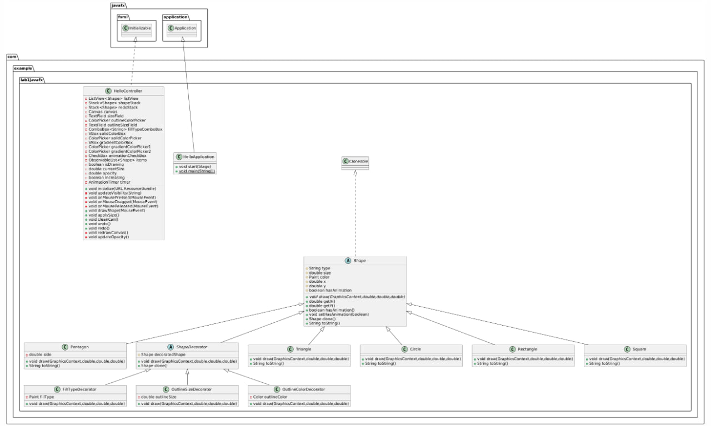

# Лабораторная работа: Карандаш (1-3, 6, 8)

## Описание проекта
Этот проект представляет собой простой графический редактор, разработанный с использованием JavaFX.
Приложение позволяет пользователю рисовать различные фигуры (квадраты, круги, треугольники и т.д.)
на холсте, изменять их размер, цвет заливки, цвет и толщину контура.

## Функциональность
- Рисование фигур: Пользователь может выбирать фигуры из списка и рисовать их на холсте, используя мышь.
- Изменение размера: Размер фигур можно изменять с помощью текстового поля.
- Цвет заливки: Пользователь может выбирать тип заливки (сплошной цвет или градиент) и настраивать цвета.
- Цвет и толщина контура: Пользователь может выбирать цвет и толщину контура фигур.
- Отмена и повтор действий: Пользователь может отменять и повторять действия с фигурами.
- Очистка холста: Пользователь может очистить холст, удалив все нарисованные фигуры.

## Требования
* Java 11 или выше
* JavaFX SDK

## Основные компоненты
- `HelloApplication` отвечает за запуск приложения и загрузку интерфейса.
- `HelloController` управляет логикой приложения, обрабатывает пользовательский ввод и взаимодействует с фабрикой фигур.
- `ShapeFactory` создает объекты фигур на основе переданного типа или числа сторон.
- `Shape` предоставляет базовую функциональность для всех фигур, включая методы для отрисовки и описания фигуры.


## Структура проекта
```
src
└── main
    ├── java
    │   └── com.example.lab1javafx
    │       ├── Circle.java               # Реализация круга
    │       ├── FillTypeDecorator.java    # Декоратор для изменения типа заливки фигуры
    │       ├── HelloApplication.java     # Основной класс приложения
    │       ├── HelloController.java      # Контроллер
    │       ├── OutlineColorDecorator.java # Декоратор для изменения цвета контура фигуры
    │       ├── OutlineSizeDecorator.java # Декоратор для изменения толщины контура фигуры
    │       ├── Pentagon.java             # Реализация пятиугольника
    │       ├── Rectangle.java            # Реализация прямоугольника
    │       ├── Shape.java                # Абстрактный суперкласс фигур
    │       ├── ShapeDecorator.java       # Абстрактный класс для декораторов фигур
    │       ├── Square.java               # Реализация квадрата
    │       ├── Triangle.java             # Реализация треугольника
    │       └── module-info.java          # Модуль для Java 9 и выше
    └── resources
        └── com.example.lab1javafx
            └── hello-view.fxml           # Файл FXML, описывающий пользовательский интерфейс
```

## Архитектура
